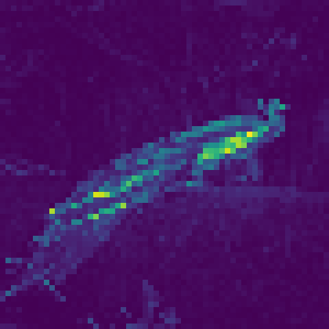

# Vision Transformers: From-Scratch Implementation, Differential Attention, and CLIP Analysis

This project provides a deep dive into Vision Transformers (ViTs), starting with a **from-scratch implementation** of the foundational ViT architecture. It then explores an extension with **Differential Attention (Diff-ViT)** and culminates in a comparative analysis of **OpenAI's CLIP** against a standard ImageNet-pretrained ResNet-50, including an investigation into FP16 performance.

This repository showcases a comprehensive understanding of transformer architectures in computer vision, attention mechanisms, experimental design, and model analysis.

## Table of Contents

1.  [Project Overview](#project-overview)
2.  [Key Accomplishments & Features](#key-accomplishments--features)
3.  [Technical Stack](#technical-stack)
4.  [Project Structure](#project-structure)
5.  [Core Modules & Experiments](#core-modules--experiments)
    *   [Module 1: Vision Transformer (ViT) from Scratch](#module-1-vision-transformer-vit-from-scratch)
    *   [Module 2: Differential Vision Transformer (Diff-ViT)](#module-2-differential-vision-transformer-diff-vit)
    *   [Module 3: CLIP vs. ImageNet Pretrained ResNet-50 Analysis](#module-3-clip-vs-imagenet-pretrained-resnet-50-analysis)
6.  [Setup and Usage](#setup-and-usage)
7.  [Showcased Results & Visualizations](#showcased-results--visualizations)
8.  [Potential Future Work](#potential-future-work)
9.  [Acknowledgements](#acknowledgements)

## Project Overview

The core objective of this project was to build a strong foundational understanding of Vision Transformers by:
*   **Implementing a Vision Transformer (ViT) entirely from scratch**, including critical components like patch embedding, multi-head self-attention, and positional embeddings.
*   Training and rigorously evaluating the custom ViT on the CIFAR-10 dataset.
*   Implementing and integrating a **Differential Attention mechanism** into the ViT framework (Diff-ViT) to explore alternative attention strategies.
*   Conducting a detailed **comparative analysis between OpenAI's CLIP and a standard ImageNet-pretrained ResNet-50**, focusing on zero-shot capabilities and performance nuances.
*   Investigating the practical implications of **FP16 precision** on model inference speed and memory for CLIP's vision encoder.
*   Developing and applying various **attention visualization techniques** (DINO-style, CLS token attention, Attention Rollout) to interpret model behavior.

## Key Accomplishments & Features

*   **Fundamental ViT Implementation (From Scratch):**
    *   Scaled Dot-Product Attention & Multi-Head Attention.
    *   Transformer Encoder block construction.
    *   Patch embedding and [CLS] token for classification.
    *   Exploration of multiple Positional Embedding types (1D learned, 2D learned, Sinusoidal).
*   **Differential ViT (Diff-ViT) Implementation:**
    *   Built the Differential Attention mechanism and Multi-Head Differential Attention module.
    *   Successfully integrated Diff-ViT into the ViT encoder for comparative studies.
*   **Comprehensive Experimentation & Analysis:**
    *   Systematic evaluation of patch size variations.
    *   Extensive hyperparameter tuning (embedding dimension, layers, heads, MLP dimensions).
    *   Investigation into the impact of various data augmentation techniques.
*   **Advanced Attention Visualization:**
    *   Generation of DINO-style [CLS] token to patch attention maps.
    *   Visualization of attention from the [CLS] token in the custom ViT on CIFAR-10.
    *   Implementation and visualization of Attention Rollout to understand global attention flow.
    *   Analysis of learned positional embedding similarities.
*   **In-Depth CLIP & ResNet-50 Comparison:**
    *   Zero-shot classification setup using CLIP on ImageNet categories.
    *   Qualitative analysis of scenarios where CLIP excels over ResNet-50 and vice-versa, supported by image examples.
    *   Quantitative analysis of FP16 conversion for CLIP's image encoder, measuring latency and memory usage.

## Technical Stack

*   Python 3.13.1
*   PyTorch
*   Torchvision
*   NumPy
*   Matplotlib & Seaborn (for plotting)
*   OpenCV (`cv2`)
*   Pillow (PIL)
*   Einops
*   Tqdm (for progress bars)
*   OpenAI-CLIP
*   WandB (for experiment tracking, as indicated by imports)

## Project Structure

```
.
|-- README.md
|-- notebooks
|   |-- 1
|   |   |-- 01_ViT_Implementation.ipynb  # Core ViT, experiments, visualizations
|   |   |-- dino_attention_maps/       # DINO-style attention viz for ViT
|   |   `-- sample_images/             # Sample images for ViT tasks
|   |-- 2
|   |   `-- 02_Differential_ViT_Implementation.ipynb # Diff-ViT, experiments
|   `-- 3
|       |-- 03_CLIP_and_ImageNet_RN50_Analysis.ipynb # CLIP vs RN50, FP16
|       |-- clip_better/                 # Images where CLIP outperforms RN50
|       |-- imagenet_rn50_better/        # Images where RN50 outperforms CLIP
|       `-- sample_images/             # Sample images for CLIP/RN50 tasks
|-- questions.pdf                      # Original assignment specification
|-- requirements.txt                   # Python dependencies
```

## Core Modules & Experiments

### Module 1: Vision Transformer (ViT) from Scratch

*   **Notebook:** `notebooks/1/01_ViT_Implementation.ipynb`
*   **Description:** This module covers the ground-up implementation of the Vision Transformer. It includes the creation of all core components, training on CIFAR-10, and extensive experimentation.
*   **Key Experiments:**
    *   Patch Size Variation (2, 4, 8).
    *   Hyperparameter Exploration (embedding dim, layers, heads, MLP dim) to achieve >80% test accuracy.
    *   Impact of Data Augmentations.
    *   Comparison of Positional Embeddings (None, 1D Learned, 2D Learned, Sinusoidal).
*   **Visualizations Implemented:**
    *   DINO Attention Maps (examples in `notebooks/1/dino_attention_maps/`).
    *   [CLS] token to patch attention maps for the trained ViT on CIFAR-10.
    *   Attention Rollout.
    *   Positional Embedding Similarity.
    *   *Example DINO Attention Map for Peacock:*
        ```
        
        ```

### Module 2: Differential Vision Transformer (Diff-ViT)

*   **Notebook:** `notebooks/2/02_Differential_ViT_Implementation.ipynb`
*   **Description:** Extends the ViT by incorporating the Differential Attention mechanism. This module focuses on implementing this novel attention and comparing its performance against the standard ViT.
*   **Key Activities:**
    *   Implementation of the Differential Attention mechanism and Multi-Head Differential Attention.
    *   Integration into the Transformer encoder.
    *   Training on CIFAR-10 (patch sizes 2/4) and comparative performance analysis.
    *   Repetition of hyperparameter, data augmentation, and positional embedding experiments for Diff-ViT.
*   **Visualizations:**
    *   Attention maps ([CLS] token to patch) for Diff-ViT.
    *   Attention Rollout for Diff-ViT.

### Module 3: CLIP vs. ImageNet Pretrained ResNet-50 Analysis

*   **Notebook:** `notebooks/3/03_CLIP_and_ImageNet_RN50_Analysis.ipynb`
*   **Description:** This module performs a comparative study of OpenAI's CLIP model (using its ResNet-50 vision backbone) against a standard ImageNet-pretrained ResNet-50.
*   **Key Analyses:**
    *   Architectural comparison of the visual encoders.
    *   Zero-shot classification setup for CLIP on 1000 ImageNet categories.
    *   Qualitative analysis using images where one model outperforms the other (see `notebooks/3/clip_better/` and `notebooks/3/imagenet_rn50_better/`).
    *   **FP16 Performance Study:**
        *   Conversion of CLIP's image encoder to FP16.
        *   Measurement of wall-clock inference time differences (FP32 vs. FP16).
        *   Analysis of GPU memory usage differences using `nvidia-smi` or profiler.
        *   Evaluation of any impact on prediction probabilities/accuracy.

## Setup and Usage

1.  **Clone the repository:**
    ```bash
    git clone <your-repo-url>
    cd <your-repo-name>
    ```
2.  **Create and activate a virtual environment (recommended):**
    ```bash
    python -m venv venv
    source venv/bin/activate  # On Windows: venv\Scripts\activate
    ```
3.  **Install dependencies:**
    ```bash
    pip install -r requirements.txt
    ```
4.  **Navigate to the `notebooks/` directory and its subfolders to run the Jupyter Notebooks:**
    ```bash
    jupyter notebook
    ```
    Open `01_ViT_Implementation.ipynb`, `02_Differential_ViT_Implementation.ipynb`, or `03_CLIP_and_ImageNet_RN50_Analysis.ipynb` to explore each module.

## Showcased Results & Visualizations

This project generates various outputs, including:
*   **Model Performance Metrics:** Loss curves and test accuracies for ViT and Diff-ViT experiments (found within the notebooks).
*   **Attention Maps:**
    *   DINO-style maps: `notebooks/1/dino_attention_maps/`
    *   ViT & Diff-ViT [CLS] token attention: Generated and displayed within respective notebooks.
    *   Attention Rollout visualizations: Generated and displayed within respective notebooks.
*   **Qualitative Image Comparisons:**
    *   Images where CLIP outperforms ResNet-50: `notebooks/3/clip_better/`
    *   Images where ResNet-50 outperforms CLIP: `notebooks/3/imagenet_rn50_better/`
*   **FP16 Analysis:** Quantitative results (latency, memory) and qualitative observations are documented in `notebooks/3/03_CLIP_and_ImageNet_RN50_Analysis.ipynb`.

## Potential Future Work

*   Train and evaluate the from-scratch ViT on larger datasets (e.g., a subset of ImageNet).
*   Implement and compare other ViT variants (e.g., DeiT, Swin Transformer).
*   Explore advanced self-supervised learning techniques with the custom ViT.
*   Further investigate model quantization (e.g., INT8) for efficiency.
*   Develop a simple Gradio/Streamlit interface for interactive model demonstration.

## Acknowledgements

*   This project was inspired by and builds upon concepts from the following seminal papers:
    *   "An Image is Worth 16x16 Words: Transformers for Image Recognition at Scale" (Dosovitskiy et al., 2020)
    *   "Emerging Properties in Self-Supervised Vision Transformers" (Caron et al., DINO, 2021)
    *   "Learning Transferable Visual Models From Natural Language Supervision" (Radford et al., CLIP, 2021)
    *   "Differential Transformer" (Ye et al,, 2025)
*   The initial structure and tasks were part of an assignment for the "Computer Vision - Spring 25" course.
